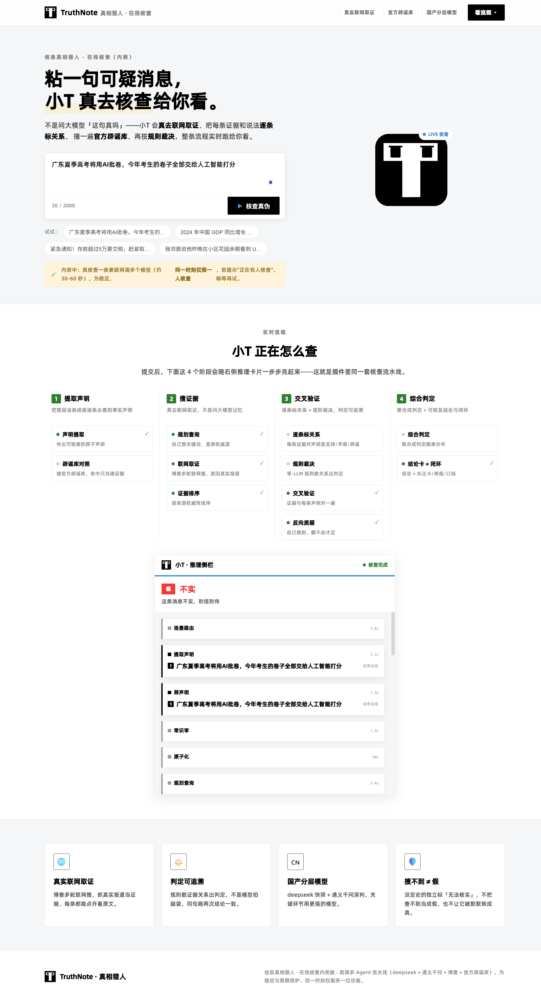
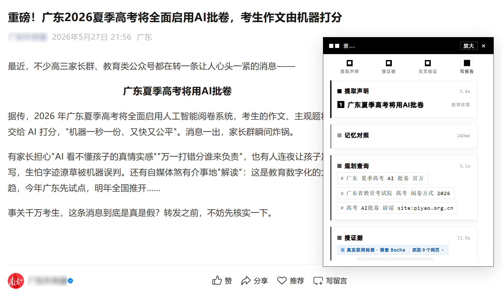
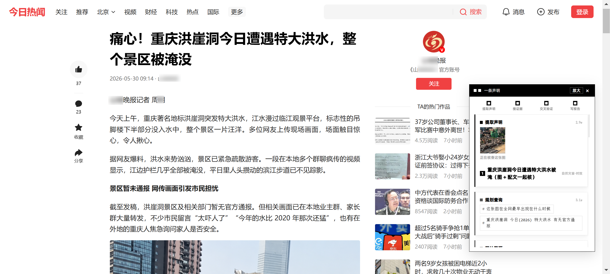
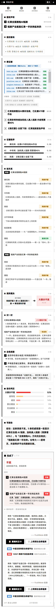
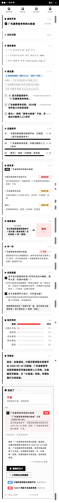
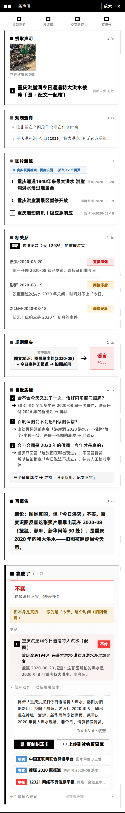
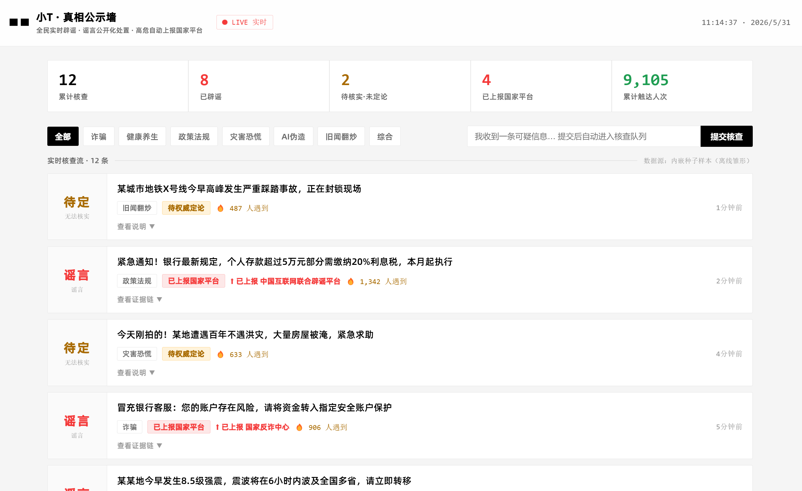
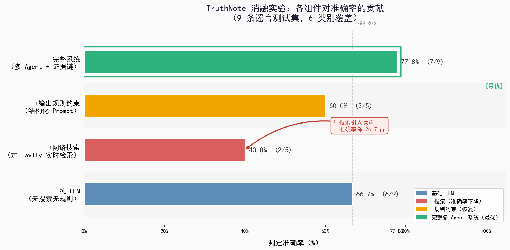
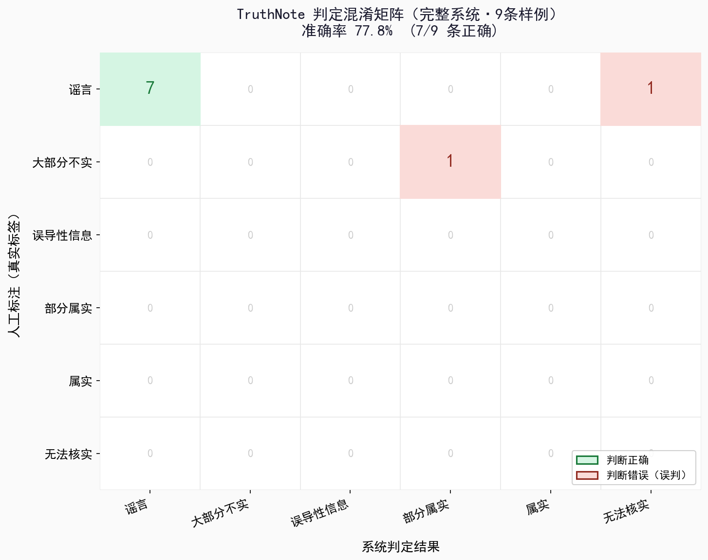
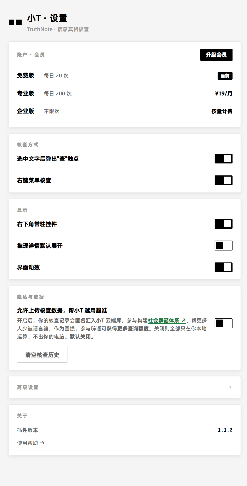

<div align="center">


# TruthNote · 真笔记

**选中文字 → 右键 → 30 秒告诉你哪里有问题。**

一个浏览器插件，背后是一套**多 Agent 事实核查引擎**——不问大模型一句真假，而是真的联网到权威源取证、按规则给出**可追溯**的判断。

<br/>


> 2026 文科松 · 赛道三「信息真相猎人」 ｜ 参赛队伍：**letme组队**

</div>

---

## 这是什么

朋友圈那条"存款超 5 万要交税"、短视频里那句"三天降血糖"、旧图配新文的"洪崖洞被淹"——**谣言换个说法就能反复翻炒，而普通人没有时间逐条去查。**

TruthNote 把"查证"压进一次右键：在任意网页选中一句话，小 T（产品里的像素助手）会**真的上网**找权威原文，几十秒后在原文旁弹出一张**推理卡片**——拆解声明、流式取证、给出判定、挂出每条证据的出处。

它不替你删假信息、也不替你下结论——它**标出来，让你自己判断**。

<div align="center">

<br/><sub>在知乎「红果短剧收益断崖式下跌」帖里选中一句话 → 侧栏弹出推理卡：拆出 2 条声明（<b>绝对化表述</b> / <b>独占归因</b>）→ 规划查询 → 真实联网检索（博查 Bocha，抓取 12 个网页）</sub>
</div>

---

## 在线体验

无需安装，浏览器直接打开 **[hd.aicuc.cn/tn/app](https://hd.aicuc.cn/tn/app/)** —— 粘一句可疑消息，看小 T 真去联网取证、逐条标关系、规则裁决，实时把整条核查流程跑给你看。

<div align="center">

<br/><sub>Web 端「真相猎人 · 在线核查」：真实联网取证 · 官方辟谣库 · 国产分层模型，浏览器里直接跑完整流程</sub>
</div>

---

## 看小 T 核查谣言（三个真实案例）

同一个动作（选中 → 查），背后是一条完整的多 Agent 流水线。三种典型谣言、三条不同的取证路径：

<table>
<tr>
<td width="33%"></td>
<td width="33%"></td>
<td width="33%"></td>
</tr>
<tr>
<td align="center"><b>红果短剧 · AI 谣言</b><br/><sub>知乎帖 → 拆 2 条声明（绝对化表述 / 独占归因）→ 博查抓 12 网页</sub></td>
<td align="center"><b>广东高考 · AI 批卷</b><br/><sub>公众号文 → 记忆对照 → 撞官方辟谣库 <code>site:piyao.org.cn</code></sub></td>
<td align="center"><b>洪崖洞被淹 · 旧图新用</b><br/><sub>今日头条 → 多模态：百度识图反查，图是 2020 年旧图</sub></td>
</tr>
</table>

每一步都看得见：**提取声明 → 规划查询 → 搜证据 → 证据排序 → 标关系 → 规则裁决 → 对一对 → 自我质疑 → 综合判定 → 写报告**。

---

## 完整推理链 · 细节审核

点开每条核查，从拆声明到上报、每一步都留痕——三个案例、三条取证路径，最后都给出**六值概率分布**的判定，并支持**一键生成纠正卡 / 上报国家辟谣平台**：

<table>
<tr>
<td width="33%" valign="top"></td>
<td width="33%" valign="top"></td>
<td width="33%" valign="top"></td>
</tr>
<tr>
<td align="center"><b>红果 · 联网取证</b><br/><sub>抓 12 源逐条比对 → <b>大部分不实 52%</b>（误导性 24% / 谣言 14% …）</sub></td>
<td align="center"><b>高考 · 命中辟谣库</b><br/><sub>记忆层撞中国互联网联合辟谣平台（已辟谣）→ <b>谣言 88%</b></sub></td>
<td align="center"><b>洪崖洞 · 多模态溯源</b><br/><sub>百度识图反查：图真（2020-08）但"今日"为假 → <b>旧图新用 · 不实</b></sub></td>
</tr>
</table>

> 三条路径各不相同：红果**靠联网取证**逐源比对；高考**先撞官方辟谣库**（记忆层）拿权威辟谣当证据；洪崖洞**走多模态图片溯源**。但判定都重新核算、绝不短路——记忆层命中也只当作一条证据。

---

## 核心亮点

- **真联网取证，不靠模型记忆。** 每条判断都来自联网调取的权威原文，证据链里每一条都能点开看出处（截图里的"搜证据 · 博查 Bocha · 抓取 N 个网页"是真的在抓）。
- **自动路由到对口权威源。** 先分诊判断领域，再把声明送到最对口的地方核对：健康 → 卫健委 / WHO，政策 → 政府网 / 新华社，诈骗 → 反诈中心，并撞官方辟谣库（`site:piyao.org.cn`）。
- **一队 12 个分工 Agent 角色 + 零-LLM 规则裁决。** 分诊 / 拆解 / 筛选 / 常识 / 提问 / 取证 / 核对 / 评级 / 交叉核查 / 质疑 / 成卡，外加保健打假规则裁决器——分工协作，关键判定由可复现的规则引擎兜底，**可复现、可追责**。
- **可解释输出，不是黑箱单标签。** 二元判定（真 / 谣言）大字前置 + 证据链（每条挂出处）+ **多维信号合成六值概率分布**，让你看见"为什么"。
- **记忆层 = 官方辟谣库检索（debunk_index）。** 对接官方权威辟谣库，命中只当作一条强证据、判定仍重新核算，**绝不短路**——搜不到 ≠ 假。
- **闭环动作。** 判完能**一键生成纠正卡**转发给长辈、**一键上报**到中国互联网联合辟谣平台 / 12321 网络不良信息举报。
- **社会闭环 · 公示墙。** 对还没定论的信息公开标注「待核实」，高危自动上报国家平台，掐断"三人成虎"。
- **国产分层模型。** 底层 `deepseek-v4-flash` 跑海量初筛，顶层 `qwen-max` 做关键判定——是这套**分工架构**让便宜的国产模型也产出可靠结果。
- **多模态溯源。** 旧图新用反查更早出处，识别"移花接木"的配图谣言。

---

## 后端是怎么做判定的 · 编排逻辑

判一条消息的真假，不是一次大模型调用，而是一条**类型驱动、分层短路、逐声明并行、多信号合议**的核查流水线：

```
 一条消息
    │
    ▼
 ① 类型路由           分诊归类，构造类型化上下文，绑定下游所有环节
    │
 ② 分层短路   ⚡零-LLM   推销话术 / 无核查价值 / 个人内容 → 规则当场分流
    │
 ③ 原子化拆解         拆成可独立证伪的声明 + 核查价值过滤
    │
 ④ 逐声明取证  ⫶并行    检索 → 来源权威性加权排序 → 结构化核对 → 对抗质疑
    │
 ⑤ 多信号合议         6 维评分 + 证实/证伪折扣 + 权威门控 → 判定概率分布
    │
 ⑥ 规则裁决   ⚡零-LLM   确定性仲裁，保守单调升级（只升不降）
    │
 ⑦ 非裁定道           搜不到 ≠ 假：独立归因（卡在哪 / 去哪查），不参与打分
    │
 ⑧ 闭环              纠正卡 + 一键上报国家辟谣平台
    │
    ▼
 推理卡片：二元判定 + 证据链 + 6 维信号
```

**① 类型路由优先，且向下绑定。** 先归类（健康 / 政策 / 诈骗 / 灾害 / AI 伪造 / 旧闻翻炒…）并构造类型化上下文，由它决定查哪些对口权威源、用哪套先验、走哪些专项检测——不是一句扁平 prompt 通吃。

**② 分层短路：确定性规则前置。** 进入昂贵的模型环节之前，先过几道零-LLM 闸门把明显不必查的当场判掉，算力只花在有核查价值的声明上，这部分行为可复现、可审计。

**③ 原子化拆解。** 真假混杂的一段话，先拆成可独立证伪的原子声明，剔除情绪与主观意见。

**④ 逐声明并行取证。** 每条声明并发跑：联网检索 → 按来源权威性加权排序（官方辟谣库 > 央媒 > 一般来源）→ 结构化核对 → 对抗式质疑（时序错位、旧闻翻炒、诈骗特征）。声明间互不阻塞，单条异常不拖垮整体。

**⑤ 多信号合议，无单点裁决。** 单条结论不是某个 Agent 拍板，而是合成一个判定概率分布——六个维度评分，叠加证据的证实/证伪后处理与来源权威性门控：

| 维度 | 信号含义 |
|---|---|
| **先验** | 该类型声明的历史可信基线 |
| **监管锚点** | 是否撞上权威辟谣 / 官方规定 |
| **生理 · 常识可能性** | 声明在物理常识上是否成立（如"三天降血糖"） |
| **语言指纹** | 绝对化表述、独占归因、煽动话术等红旗 |
| **反事实测试** | 把声明反过来是否更自洽 |
| **错误代价** | 判错的社会成本（高危偏保守） |

**⑥⑦⑧ 由确定性规则裁决层仲裁，并守住四条写进系统的工程契约（不变量）：**

| 契约 | 含义 |
|---|---|
| **INV-4** | 记忆层（官方辟谣库）命中只当一条证据，判定仍重新核算、**不短路** |
| **INV-U** | "无法核实"不给二元判定、**不参与打分**——搜不到 ≠ 假，走独立非裁定道 |
| **INV-2** | 保健 / 推销高危**强制升级、只升不降**，不把已成立的风险信号静默压低 |
| **失败安全** | 任一环节异常 → 自动降级为"无法核实"，绝不编造结论（**失败不算成功**） |

> **智能在架构里，不在单次模型调用里。** 类型路由决定怎么查、规则层决定怎么判、非裁定道守住"不冤枉"、确定性兜底守住"可复现"——正是这套编排，让便宜的国产分层模型也能产出可追责的判定。

---

## 全程国产 · 分层调度

核查全程只用国产模型，按"贵不贵"分两层调度——海量初筛用便宜的，关键判定才上强模型：

| 层 | 模型 | 职责 |
|---|---|---|
| 基础层 | **DeepSeek V4 Flash** | 声明提取 / 分诊路由 / 证据排序 / 成卡等高频环节，跑量经济 |
| 关键层 | **通义千问 Qwen-Max** | 交叉核对 / 反向质疑等关键判定 |

全程国产带来两件事：**数据合规、可私有化部署**；以及——是上面那套编排架构，让便宜的国产模型也产出可靠、可追溯的结果。**不是堆最大的模型，是把模型用在刀刃上。**

> 判定体系对外呈现为**二元（真 / 谣言）**，仅是展示层投影；内部保留六值（属实 / 部分属实 / 误导性 / 大部分不实 / 谣言 / 无法核实），`无法核实`走独立的"非裁定"通道，**绝不折叠进"谣言"**——搜不到不等于假。

---

## 更多真实场景

<table>
<tr>
<td width="50%"></td>
<td width="50%"></td>
</tr>
<tr>
<td align="center"><b>灰色地带也敢标</b><br/><sub>学说/推测类不一刀切真假，标「待核实」并说明</sub></td>
<td align="center"><b>不该查的不乱查</b><br/><sub>个人吐槽 / 无核查价值的话，不强行判定</sub></td>
</tr>
</table>

---

## 社会辟谣体系 · 公示墙

判完不是结束。核查记录（用户授权后匿名）汇入小 T 云端库，构成一面**实时公示墙**：谣言公开化处置、待核实公开标注、高危自动上报国家平台。三人成虎的链子，就在这盏灯下被掐断。

<div align="center">

<br/><sub>真相公示墙：累计核查 / 已辟谣 / 待核实 / 已上报国家平台 / 累计触达，按品类（诈骗 · 健康养生 · 政策法规 · 灾害恐慌 · AI 伪造 · 旧闻翻炒）实时滚动</sub>
</div>

---

## 后端服务 & 评测

插件通过 HTTP 调用本地 FastAPI 引擎，后端自带核查演示、闭环追踪、评测报告三个可视化页面。模型走国产分层：基础层 **DeepSeek V4 Flash** + 关键层 **Qwen 3.7 Max**。

在自建中文谣言评测集（**N=86**，覆盖 9 个品类）上：

| 指标 | 数值 |
|---|---|
| 六分类准确率 | **77.8%** |
| 二分类（真 / 谣言）准确率 | **91.3%** |

<sub>样本量有限，数字用于展示架构迭代趋势，非行业基准。</sub>

<div align="center">
 &nbsp; 
</div>

> 消融实验显示：**联网证据搜索是准确率的关键变量**——证据质量决定"证实"维度的上限。准确率随版本迭代提升，核心增益来自架构改进（分诊路由、规则兜底、辟谣库交叉验证），而非更换更大的模型。

---

## 产品形态 & 设计语言

<table>
<tr>
<td width="38%"></td>
<td width="62%">

**视觉基因**：纯矩形、直角、黑白主色，唯一的圆形是字母 o。助手"小 T"像 R2-D2——聪明、温暖、可靠，但明确是机器：只有两只像素方块眼睛 `■ ■`，没有嘴，说话从不超过五个字（"查。" / "都对。" / "小 T 没查到。"）。

**色彩只有黑白 + 三判定色**，是全产品唯一的彩色：

| 判定 | 色值 | 含义 |
|---|---|---|
| 🟢 查到了 | `#3ECF72` | 有权威依据 |
| 🔴 不对 | `#F43939` | 被权威源反驳 |
| 🟡 小 T 没查到 | `#FFB020` | 没找到可靠来源（≠ 假） |

**隐私优先**：核查默认全部在本地运算，开启「允许上传」才匿名汇入云端库、参与社会辟谣体系（参与辟谣可换更多额度）。完整品牌规范见 [`前端/TruthNote-Design-Spec-v1.0.md`](前端/TruthNote-Design-Spec-v1.0.md)。

</td>
</tr>
</table>

---

## 技术栈

| 层 | 技术 |
|---|---|
| 浏览器插件 | Manifest V3，原生 JS，适配微博 / 知乎 / 微信 / 小红书 / B 站 / X / 豆瓣 / 头条 / 贴吧等主流平台 |
| 后端 | Python · FastAPI（含流式取证 `/api/verify_stream`、图片溯源 `/api/verify_image_source`） |
| 引擎 | Orchestrator 编排 + 12 个 Agent 角色 + 零-LLM 规则检测器 + 记忆层（官方辟谣库 `debunk_index`）+ 证据搜索（博查 Bocha / 360） |
| 模型 | 国产分层：`deepseek-v4-flash`（初筛）+ `qwen-max`（关键判定） |
| 多模态 | 通义千问 VL 图片溯源 + 反向搜图 |

---

## 快速开始

```bash
# 1) 安装依赖
pip install -r requirements.txt

# 2) 配置：复制 .env.example 为 .env
cp .env.example .env
#    生产推荐填 DEEPSEEK_API_KEY + DASHSCOPE_API_KEY（+ BOCHA_API_KEY 用博查取证）
#    零 key 体验：把 .env 里 LLM_PROVIDER 改 claude_cli、SEARCH_PROVIDER 改 so360

# 3) 启动后端（默认端口 8000）
python run.py

# 4) 加载插件：Chrome → 扩展程序 → 开启「开发者模式」
#    →「加载已解压的扩展程序」→ 选 前端/extension 目录（或从 Releases 下载 zip 解压加载）
#    注：插件默认连后端 http://localhost:8000，需后端跑在 8000 端口

# 命令行调试单条
python cli.py "紧急通知！存款超5万要交税！"
```

> 📦 预打包的插件见本仓 [**Releases**](../../releases)：下载 zip 解压后「加载已解压的扩展程序」即可。

---

## 目录结构

```
truthnote/
├── 前端/extension/            浏览器插件（MV3）：选中触点 · 推理卡片 · 多 Agent 编排可视化
│   └── TruthNote-Design-Spec  完整设计规范 v1.0
├── src/truthnote/             核查引擎
│   ├── orchestrator.py        编排器（12 Agent 调度）
│   ├── agents.py              各 Agent 定义
│   ├── dimensions.py          6 维度推理矩阵
│   ├── debunk_index.py        官方辟谣库检索（记忆层）
│   ├── promo_health.py        推销/保健品举证负担子流水线
│   ├── search.py / image.py   证据搜索 · 图片溯源
│   └── ...
├── run.py                     FastAPI 后端
├── cli.py                     命令行单条核查
├── scenarios/                 测试集（rumor / demo cases）
├── tests/                     单元 / 契约 / 对抗测试（374 项）
└── assets/                    Logo · 截图 · 评测图表
```

---

## 团队

**letme组队** · 2026 文科松 · 赛道三 — 信息真相猎人

成员：苗七也、郭鲁豫

---

<div align="center">

**一盏灯，照一条。一片星，照一亿。**

<sub>TruthNote · 帮你看看，靠不靠谱。</sub>

</div>
